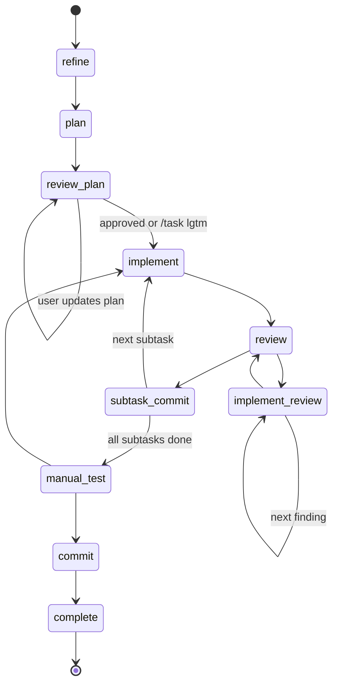

# pi-task workflow state machine

`pi-task` is a Pi extension that turns AI-assisted coding into a deterministic, ticket-driven workflow. It connects GitHub Issues, `jj` workspaces, and Pi's agent loop so that each task gets its own isolated workspace, explicit workflow state, review gates, subtasks, commits, and final squash-merge path.

The core idea is: instead of asking an agent to "go build this", the extension drives it through a structured lifecycle: refine, plan, review the plan, implement, review, fix findings, manual test, commit, and merge.

It's designed to require my attention only at specific points, so that I can run different tasks asynchronously (including homeschooling etc).

Original inspiration: https://github.com/badlogic/claude-commands

Agents tend to get distracted by spurious context, influenced by context earlier in the conversation, etc. The extension uses Pi's conversation tree to give each workflow step an isolated context.

Before running a step, the workflow navigates back to the point in the conversation where `/task` was originally run, then sends the prompt for the current state, including the root issue content and any sub-issue content. This means each step sees a controlled context: workflow metadata, the active issue path, and the state-specific instructions. The extension can then read the assistant's response from that branch and apply the next state transition.

However this is tricky in pi because it's not clear when an agent turn is completely settled, and so the `end_turn` events do not have access to manipulate the conversation tree. This is because things may happen asynchronously after the end of the turn (compaction, steering, extension follow-up commands etc). This is an active area of development in pi: https://github.com/earendil-works/pi/issues/2023 & https://jot.mariozechner.at/s/cy2bzlpoilaanc.

## Mermaid diagram



## Future plans

- Codify TDD in states & transitions
  - `implement-test`
  - `review-tests`
  - `implement-test-review`
- Deterministic formatting/linting after implementation steps

## YAML blocks used by transitions

Plan subtasks live in the root issue:

```
 ## Plan
 <subtasks>
 - title: Example subtask
   description: |
     What needs to be done.
   tdd: true
 </subtasks>
```

Review findings:

```
 <review-findings>
 - title: Fix edge case
   description: |
     The implementation misses this case.
   tdd: true
 </review-findings>
```

Manual-test followups:

```
 <manual-test-subtasks>
 - title: Fix manual test failure
   description: |
     What failed during manual verification.
   tdd: true
 </manual-test-subtasks>
```

Commits:
```
 <commit-message>
 Implement task workflow diagram
 Explain transitions and update docs.
 </commit-message>
```

## Transition summary

| From | To | Trigger | Criteria / effects |
|---|---|---|---|
| `refine` | `plan` | `<transition>plan</transition>` | Begin planning. |
| `plan` | `review-plan` | `<transition>review-plan</transition>` | Root issue must contain a valid `## Plan` with non-empty `<subtasks>`. |
| `review-plan` | `review-plan` | `<transition>review-plan</transition>` | Re-review after plan changes. Plan subtasks must still parse. |
| `review-plan` | `implement` | `<transition>implement</transition>` or `/task lgtm` | Creates child issues from plan subtasks; activates first subtask. |
| `implement` | `review` | Agent turn completes | Deterministic transition after implementation prompt. |
| `review` | `implement-review` | `<transition>implement-review</transition>` + `<review-findings>` | Creates finding issues under current subtask; activates first finding. |
| `implement-review` | `implement-review` | Agent turn completes | Closes current finding and moves to next finding. |
| `implement-review` | `review` | Agent turn completes | Closes final finding and returns to parent subtask review. |
| `review` | `subtask-commit` | `<transition>subtask-commit</transition>` or `/task lgtm` | Review approved. |
| `subtask-commit` | `implement` | `<commit-message>` and next subtask exists | Closes current subtask, runs `jj commit`, activates next subtask. |
| `subtask-commit` | `manual-test` | `<commit-message>` and no subtasks remain | Closes current subtask, runs `jj commit`, returns to root. |
| `manual-test` | `implement` | `<transition>implement</transition>` + `<manual-test-subtasks>` | Creates follow-up subtasks from manual test failures. |
| `manual-test` | `commit` | `<transition>commit</transition>` | Manual verification passed. |
| `commit` | `complete` | `<commit-message>` | Closes root issue and runs final `jj commit`; workspace is ready to merge. |

