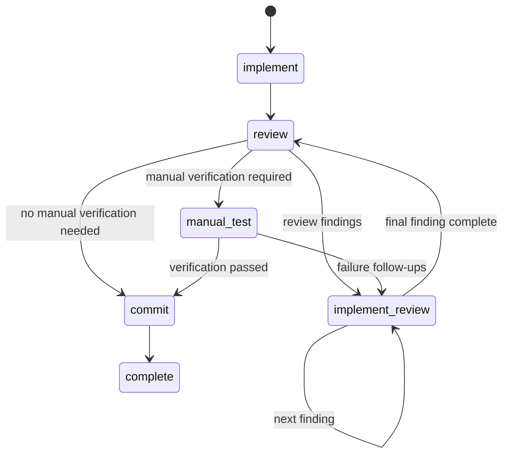

# Fix workflow implementation plan

## Goal

Add an optional `/fix` workflow for issues that already contain enough information to implement without refine, planning, or plan review.

The fix workflow will reuse the existing workflow persistence, prompt runner, GitHub issue effects, review-finding issues, `jj` workspace management, and merge path. It will have its own smaller state graph selected by an explicit persisted workflow kind.

## Workflow



### Transition contract

- `implement -> review`
  - Deterministic after the implementation turn, or via `/fix done`.
  - Root issue remains active.
- `review -> implement-review`
  - Requires a non-empty `<review-findings>...</review-findings>` block and `<transition>implement-review</transition>`.
  - Creates/reuses child issues under the root and activates the first finding.
- `implement-review -> implement-review`
  - Closes the current finding and activates the next sibling finding.
- `implement-review -> review`
  - Closes the final finding and returns to the root issue.
- `review -> commit`
  - Uses `<transition>commit</transition>` when automated verification is sufficient and no manual-test pass is pending.
- `review -> manual-test`
  - Uses `<transition>manual-test</transition>` when meaningful manual verification is required.
- `manual-test -> implement-review`
  - After user confirmation that a failure should become implementation work, parses `<manual-test-subtasks>...</manual-test-subtasks>`, creates/reuses root child issues, records them as manual-test follow-ups, and activates the first child.
- `manual-test -> commit`
  - Uses `<transition>commit</transition>` only after verification succeeds.
- `commit -> complete`
  - Requires `<commit-message>...</commit-message>`, creates the single fix commit, closes the root issue, and leaves the workspace ready to merge.

### Manual-test latch

Persist whether manual verification is pending so it cannot be skipped after a failed pass:

```ts
type ManualTestStatus = "undecided" | "pending" | "passed";
```

- New fix workflows start at `undecided`.
- `review -> manual-test` sets it to `pending`.
- Manual-test follow-up implementation leaves it `pending`.
- While `pending`, successful review must return to `manual-test`; direct `review -> commit` is rejected.
- Successful `manual-test -> commit` sets it to `passed`.
- Direct `review -> commit` is allowed only while `undecided`.

This field is fix-workflow metadata; the existing task workflow keeps its current deterministic manual-test behavior.

## Persistence model

### Workflow discriminator

Add an explicit workflow kind:

```ts
type WorkflowKind = "task" | "fix";
```

Persist it in `.tasks/workflow.json` as `workflow_kind`.

Use discriminated workflow/snapshot types where practical so invalid state/kind combinations are caught by TypeScript and runtime validation.

### Allowed states and depths

Task workflow rules remain unchanged.

Fix workflow states:

- Depth 0: `implement`, `review`, `manual-test`, `commit`, `complete`
- Depth 1: `implement-review`
- Invalid: `refine`, `plan`, `review-plan`, `subtask-commit`

The fix tree contains:

- Depth 0: root fix issue
- Depth 1: code-review or manual-test follow-up issues

The global maximum tree depth can remain 2 for compatibility with task workflows.

### Schema migration

Bump the workflow schema version and add a deterministic migration from schema version 1:

- Add `workflow_kind: "task"`.
- Preserve all existing state, tree, session, pending-run, follow-up, version, and transition fields.
- Do not increment workflow `version`; schema migration is not a workflow transition.
- Save the migrated workflow atomically.
- Continue to fail fast for malformed data or unknown schema versions.

New workflow factories:

- Task: `workflow_kind: "task"`, initial state `refine`, root active.
- Fix: `workflow_kind: "fix"`, initial state `implement`, root active, manual-test status `undecided`.

## State-machine structure

Keep one public functional-core API while dispatching to two logical graphs:

```ts
transition(snapshot, event) {
    switch (snapshot.workflowKind) {
        case "task": return transitionTask(snapshot, event);
        case "fix": return transitionFix(snapshot, event);
    }
}
```

In `state-machine.ts`:

1. Add workflow-kind and fix snapshot types.
2. Preserve the current transition switch as the task graph.
3. Add a small fix transition function.
4. Reuse shared helpers for:
   - assistant-output parsing,
   - issue-draft parsing,
   - finding issue effects,
   - commit-message parsing,
   - active-task movement,
   - completing follow-up implementation.
5. Make state/depth validation kind-aware.
6. Make replay detection kind-aware, especially because fix review accepts `commit`/`manual-test` while task review accepts `subtask-commit`.
7. Make force approval kind-aware:
   - Task review: existing behavior.
   - Fix review: move to `manual-test` if manual testing is pending; otherwise move to `commit`.
8. Keep `/fix done` valid only for `implement` and `implement-review`.

Do not add `implement-fix`, `review-fix`, `implement-fix-review`, or `commit-fix`; workflow kind identifies the graph while state identifies the phase.

## Shell and command changes

Refactor shared command/workspace behavior in `index.ts` so workflow creation and execution are parameterized by workflow kind rather than duplicated.

### `/fix` command

Register `/fix` with behavior parallel to `/task`:

- Main workspace:
  - Merge handling remains shared with `/task`.
  - Select an eligible open root GitHub issue.
  - Exclude issues already active in either task or fix workspaces.
  - Mark the issue `status:in-progress`.
  - Create the same `jj` workspace layout.
  - Initialize a fix workflow at root `implement`.
- Fix workspace:
  - `/fix` runs/resumes the workflow loop.
  - `/fix done` applies `MANUAL_DONE`.
  - `/fix lgtm` force-approves review according to the manual-test latch.
- Unsupported fix subcommands produce an explicit error.
- `/fix apply` is not supported because fix workflows have no plan-review stage.

### Command/workflow mismatch

When a persisted workflow exists:

- `/task` in a fix workspace should instruct the user to run `/fix`.
- `/fix` in a task workspace should instruct the user to run `/task`.
- Do not infer workflow kind from the current state.

Keep `/task delete` as the generic main-workspace cleanup command unless there is a concrete UX reason to duplicate it as `/fix delete`.

### Kind-aware shell helpers

Update helpers that currently receive only `WorkflowState` to receive a snapshot or `(workflowKind, state)`, including:

- workflow validation and active-depth checks,
- pending prompt-run replay detection,
- outside-loop transition notifications,
- force-LGTM handling,
- prompt selection,
- workflow UI/status projection,
- completion messages.

Include workflow kind in the issue metadata header and session-state projection.

## Prompt design

Add bundled fix prompts under a separate namespace:

```text
prompts/fix/implement.md
prompts/fix/review.md
prompts/fix/implement-review.md
prompts/fix/manual-test.md
prompts/fix/commit.md
```

Support overrides in this order:

```text
.pi/fix/<state>.md
~/.pi/agent/fix/<state>.md
prompts/fix/<state>.md
```

Support corresponding `-append.md` files using the same precedence as task prompts.

### `fix/implement.md`

- Treat the root issue as the complete fix specification.
- Implement the full issue rather than a plan subtask.
- Default to TDD.
- Allow root issue marker `<!-- tdd: false -->` as an explicit exemption.
- Maintain root `## Summary of Changes`.
- Add/update a root manual-test plan when end-to-end behavior requires it.
- Do not commit or perform lifecycle actions.

### `fix/review.md`

- Review the entire uncommitted fix against the root issue.
- Emit findings using the existing `<review-findings>` schema.
- If findings exist, transition to `implement-review`.
- If no findings and manual testing is pending, transition to `manual-test`.
- If no findings and manual testing is undecided:
  - transition to `manual-test` when user-facing verification is useful, the issue contains a manual-test plan, or manual confirmation is otherwise required;
  - transition directly to `commit` when automated verification is sufficient;
  - ask one clarifying question when uncertain.
- Never transition directly to commit after a manual-test failure until a later manual-test pass.

### `fix/implement-review.md`

- Treat the active depth-1 child as a focused follow-up.
- Support both code-review findings and manual-test failure follow-ups.
- Keep changes uncommitted until the final fix commit.
- Maintain the child `## Summary of Changes` and update root verification content when needed.

### `fix/manual-test.md`

- Reuse the current manual-test triage gate and user-confirmation behavior.
- On success, emit `<transition>commit</transition>`.
- On a confirmed failure requiring implementation:
  - update root manual verification notes,
  - emit `<manual-test-subtasks>...</manual-test-subtasks>`,
  - emit `<transition>implement-review</transition>`.
- Ensure a failed pass is rerun after follow-ups are implemented and reviewed.

### `fix/commit.md`

- Review `jj st` and `jj diff`.
- Ensure root `## Summary of Changes` is accurate.
- Produce one final multiline `<commit-message>`.
- Do not assume a root plan or prior subtask commits.

## Commit safety

The current task final-commit behavior permits an empty working copy and updates the parent commit description because task subtask commits already contain the implementation.

For a fix workflow:

1. Preflight the working copy before interpreting final close/commit effects.
2. Reject or block final commit when the working copy is empty.
3. Never run `jj desc -r @-` as the empty fix fallback.
4. Do not close the root issue when the preflight fails.
5. Continue to require that the working copy is clean after `jj commit` succeeds.

Keep the existing task-workflow empty-final-commit behavior unchanged.

## GitHub follow-up behavior

- Review and manual-test follow-ups are root sub-issues.
- Existing open child issues with the exact same title may be reused.
- Closed children are not reused, matching current GitHub lookup behavior.
- Completing `implement-review` closes each child.
- Replacing the active child list in local workflow state remains acceptable; `manual_test_followups` preserves manual-test history needed for later prompts.
- Closing the root remains exclusive to successful final commit handling.

## Tests

### State-machine tests

Extend `test/state-machine.transition.test.ts` with fix snapshots covering:

- Initial/root `implement -> review`.
- Root review approval directly to commit.
- Root review selection of manual-test.
- Review finding creation under the root.
- Multiple finding iteration and return to root review.
- `/fix done` behavior for implement and implement-review.
- `/fix lgtm` behavior with manual testing undecided and pending.
- Rejection of task-only states in a fix workflow.
- Rejection of direct commit while manual testing is pending.
- Manual-test success to commit.
- Manual-test follow-up creation under root and transition to implement-review.
- Return to manual-test after follow-up implementation and successful review.
- Commit to complete with root closure and commit effects.

Extend `test/state-machine.parse.test.ts` for kind-aware replay detection:

- Fix review `commit` and `manual-test` transitions.
- Fix review findings.
- Fix manual-test follow-up transition.
- Task replay behavior remains unchanged.

### Persistence and invariant tests

Add tests for:

- Schema-1 migration to `workflow_kind: "task"`.
- Fix workflow initialization.
- Kind-specific allowed states.
- Kind-specific active depth validation.
- Manual-test latch persistence.
- Pending prompt-run/replay behavior retaining workflow kind.

### Command and prompt tests

Extend index tests for:

- `/fix` command registration/routing through exported testable helpers.
- Task/fix command mismatch errors.
- Issue exclusion across both workflow kinds.
- Fix prompt lookup and override precedence.
- Fix session-state projection metadata.
- Fix completion/status wording.

### Commit safety tests

Add tests proving:

- Empty final task workflow still uses the existing parent-description behavior.
- Empty final fix workflow is blocked before root closure.
- Non-empty final fix runs one `jj commit` and closes the root.
- A failed fix commit leaves workflow state unadvanced.

### Regression verification

Run:

```bash
npm test
npm run typecheck
```

All existing task-workflow tests must continue to pass without changing the current task transition contract.

## Documentation and recovery updates

Update:

- `README.md`
  - Document `/fix`, its state graph, manual-test branching, and intended use.
  - Clarify when `/task` is preferable.
- `AGENTS.md`
  - Add the fix workflow, commands, states, transitions, and invariants.
- `skills/task-workflow/SKILL.md`
  - Make recovery instructions workflow-kind aware.
  - Tell users to resume with `/task` or `/fix` according to `workflow_kind`.
- `skills/task-workflow/references/workflow-json.md`
  - Document schema migration, `workflow_kind`, manual-test status, fix depths, and fix repair recipes.

## Suggested implementation order

1. Add workflow-kind types, schema migration, and kind-aware validation.
2. Add the pure fix state graph and state-machine tests.
3. Add the manual-test latch and fix follow-up transitions.
4. Add fix prompt resolution and bundled prompts.
5. Refactor shared command/workspace creation and register `/fix`.
6. Add fix commit preflight and shell-level safety tests.
7. Add command, replay, persistence, and prompt-resolution tests.
8. Update README, agent instructions, and recovery documentation.
9. Run the full test suite and typecheck.

## Non-goals

- No fix-specific copies of every state name.
- No plan generation or plan-review support in `/fix`.
- No per-finding commits; `/fix` produces one final implementation commit.
- No automatic conversion between task and fix workflows after workspace creation.
- No generalized declarative workflow-definition framework unless implementation demonstrates a concrete need for one.
