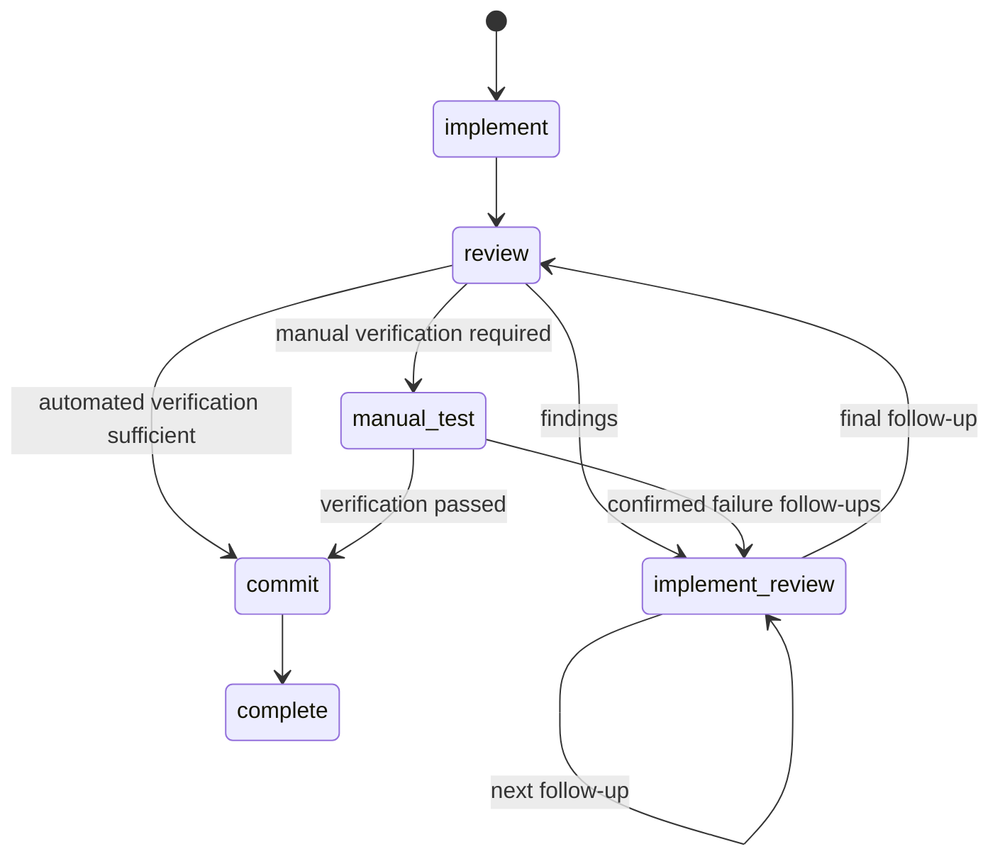

# Fix workflow

## Goal

`/task` is the canonical command for both full task workflows and lightweight fix workflows. Fix selection is label-based only during workspace initialization; persisted workflow state controls every later run.

## Initialization

From the main workspace, `/task` lists eligible open root GitHub issues and shows each issue's inferred kind.

- Exact, case-insensitive `fix` label membership initializes `workflow_kind: "fix"` at root `implement` with `manual_test_status: "undecided"`.
- Any other label set initializes `workflow_kind: "task"` at root `refine`.
- Similar labels such as `bugfix` do not select the fix workflow.

Issue labels are paginated so inference is not limited by the first 50 labels. Immediately before initialization, the selected issue is refetched and verified to still be open and root. The extension marks the issue `status:in-progress`, but does not create, add, or remove the user-owned `fix` label.

After initialization, `.tasks/workflow.json` is authoritative. Changing issue labels does not convert an existing workflow.

## Commands

- `/task` creates or resumes either persisted workflow kind.
- `/task done` applies the kind-specific manual implementation completion transition.
- `/task lgtm` applies kind-specific force approval and preserves the fix manual-test latch.
- `/task apply` is task-only and valid only in `review-plan`.
- `/task delete` is available from the main workspace.
- `/fix` is retained only as a compatibility alias that delegates to `/task`; it does not choose workflow kind.

Recovery, replay, and manual-test messages always direct users to `/task`.

## Fix state graph



Fix workflows allow root `implement`, `review`, `manual-test`, `commit`, and `complete`, plus depth-1 `implement-review`. They produce one final implementation commit. The manual-test latch prevents review from skipping a required rerun after follow-up work.

## Persistence and prompts

Schema 2 persists `workflow_kind: "task" | "fix"`. Schema-1 workflows migrate to task kind without incrementing workflow version. Existing schema-2 fix workflows resume through `/task`, including pending prompt runs and manual-test state.

Prompt selection remains kind-aware because task and fix workflows share state names with different semantics. Fix prompt precedence is:

```text
.pi/fix/<state>.md
~/.pi/agent/fix/<state>.md
prompts/fix/<state>.md
```

Task prompt namespaces remain unchanged.

## Verification

Run:

```bash
npm test
npm run typecheck
```
